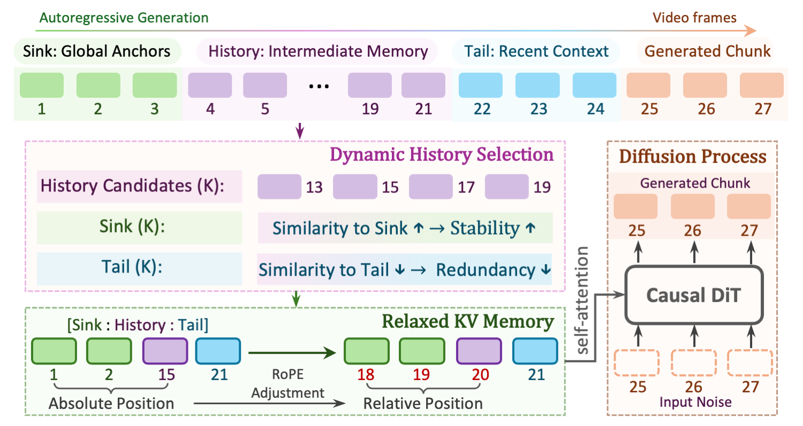
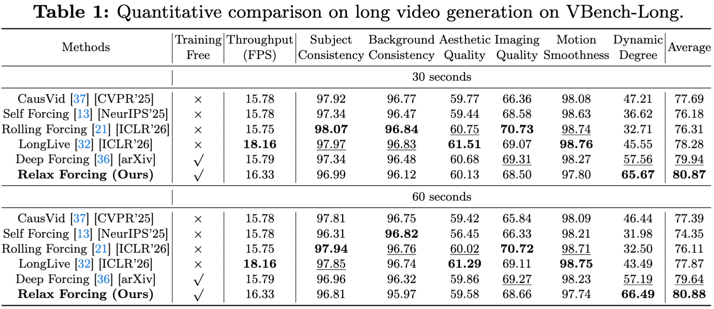

<div align="center">

# Relax Forcing: Relaxed KV-Memory for Consistent Long Video Generation

**Zengqun Zhao<sup>1</sup> · Yanzuo Lu<sup>2</sup> · Ziquan Liu<sup>1</sup> · Jifei Song<sup>3</sup> · Jiankang Deng<sup>2</sup> · Ioannis Patras<sup>1</sup>**

<sup>1</sup>Queen Mary University of London · <sup>2</sup>Imperial College London · <sup>3</sup>Huawei R&D UK

[](https://arxiv.org/abs/TODO)
[](https://zengqunzhao.github.io/Relax-Forcing)

</div>

---

## 💡 TL;DR

**Relax Forcing** improves long-horizon autoregressive video generation by replacing dense full-history attention with a structured memory design: **Sink** for stability, **Tail** for short-term continuity, and selected **History** for motion guidance. This yields better temporal dynamics and consistency on VBench-Long while reducing attention overhead and improving scalability.

## 📖 Abstract

Autoregressive (AR) video diffusion has recently emerged as a promising paradigm for long video generation, enabling causal synthesis beyond the limits of bidirectional models. To address training–inference mismatch, a series of self-forcing strategies have been proposed to improve rollout stability by conditioning the model on its own predictions during training. While these approaches substantially mitigate exposure bias, extending generation to minute-scale horizons remains challenging due to progressive temporal degradation.

In this work, we show that this limitation is not primarily caused by insufficient memory, but by **how temporal memory is utilised during inference**. Through empirical analysis, we find that increasing memory does not consistently improve long-horizon generation, and that the temporal placement of historical context significantly influences motion dynamics while leaving visual quality largely unchanged.

Motivated by this insight, we introduce **Relax Forcing**, a structured temporal memory mechanism for AR diffusion. Instead of attending to the dense generated history, Relax Forcing decomposes temporal context into three functional roles:
- 🟢 **Sink** — global stability anchors
- 🟣 **History** — dynamically selected intermediate motion structure
- 🔵 **Tail** — recent short-term continuity

This design mitigates error accumulation during extrapolation while preserving motion evolution. Experiments on VBench-Long demonstrate that Relax Forcing improves motion dynamics and overall temporal consistency while reducing attention overhead.

## 🔍 Method



**Figure 1.** Overview of Relaxed KV Memory. Instead of retaining dense chronological history, temporal memory is decomposed into three functional components: **Sink** for global anchors, **History** for intermediate motion structure, and **Tail** for recent continuity. During generation, candidate historical frames are dynamically selected to remain aligned with Sink while avoiding redundancy with Tail. The selected memory is then integrated through a relaxed KV formulation with adjusted relative positional encoding, enabling the model to leverage non-contiguous temporal context while preserving long-range consistency during autoregressive rollout.

## 📈 Quantitative Results



**Relax Forcing achieves state-of-the-art performance on VBench-Long**, outperforming all compared methods in Dynamic Degree and Average score at both 30-second and 60-second generation lengths, while maintaining competitive throughput (16.33 FPS).

## 🗓️ Release Progress

- [x] Paper
- [ ] Code

## 🔖 Citation

If you find this work useful for your research, please consider citing our paper and giving this repo a ⭐️.

```bibtex
@article{zhao2026relaxforcing,
  title={Relax Forcing: Relaxed KV-Memory for Consistent Long Video Generation},
  author={Zhao, Zengqun and Lu, Yanzuo and Liu, Ziquan and Song, Jifei and Deng, Jiankang and Patras, Ioannis},
  journal={arXiv preprint},
  year={2026}
}
```

## 🙏 Acknowledgements

- [Self-Forcing](https://github.com/gdhe17/Self-Forcing): the foundational codebase and algorithm we built upon. Thanks for their wonderful work.
- [Wan](https://github.com/Wan-Video/Wan2.1): the base video diffusion model we built upon. Thanks for their wonderful work.
