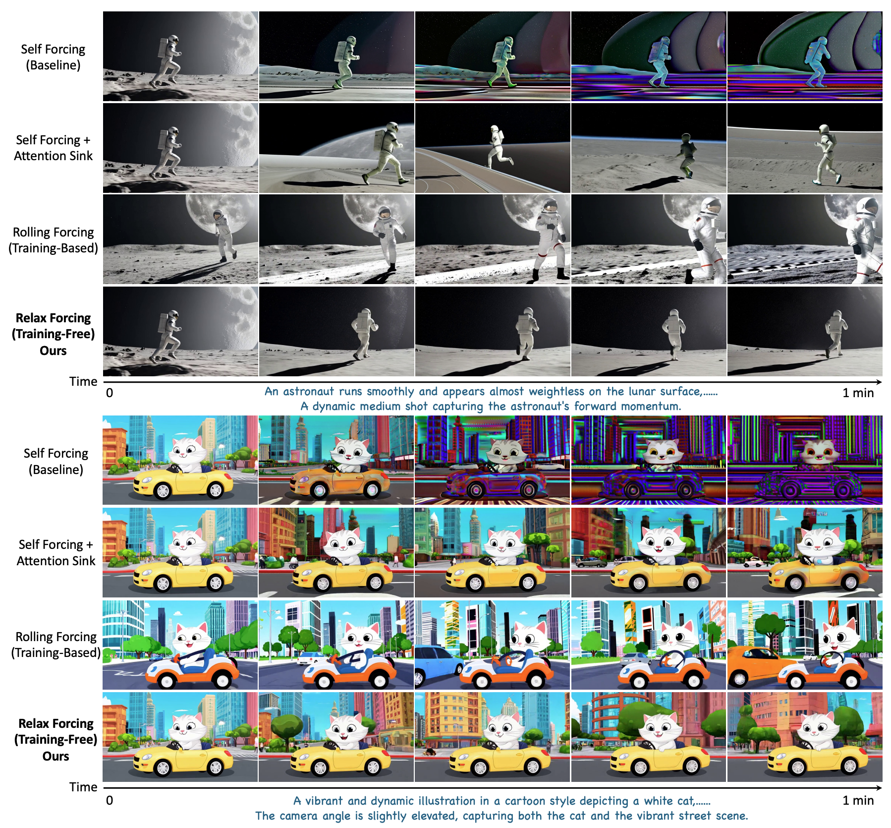
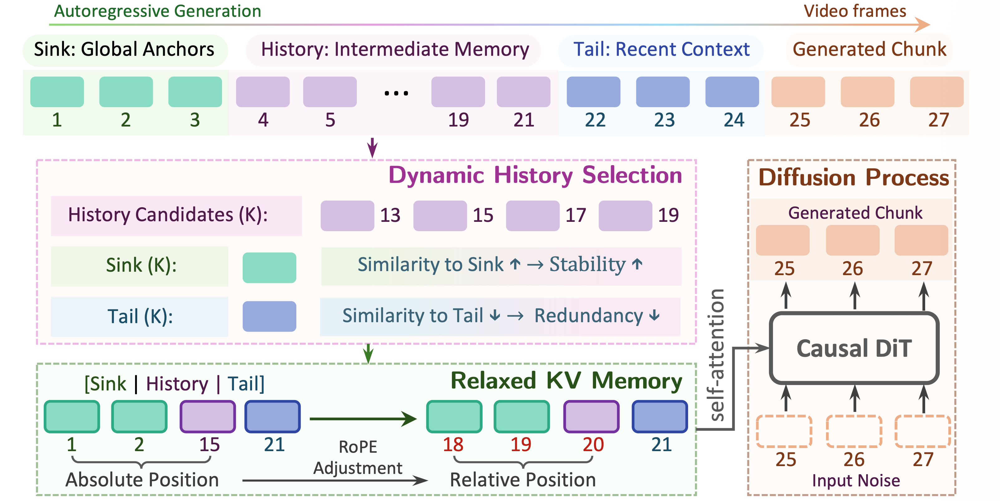
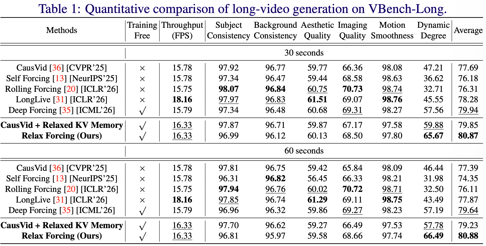

<div align="center">

# Relax Forcing

### Relaxed KV-Memory for Consistent Long Video Generation

Zengqun Zhao · Yanzuo Lu · Ziquan Liu · Jifei Song · Jiankang Deng · Ioannis Patras

Queen Mary University of London · Imperial College London

[](https://bmvc2026.bmva.org/)
[](https://arxiv.org/abs/2603.21366)
[](https://zengqunzhao.github.io/Relax-Forcing)
[](LICENSE)

**Accepted at BMVC 2026**



</div>

Relax Forcing is a training-free memory policy for long-horizon autoregressive
video diffusion. It replaces dense chronological KV memory with structured
global anchors, selected intermediate history, and recent context. This design
preserves long-term consistency without over-constraining motion, while reducing
the effective attention length from 21 to 7 latent frames.

This repository contains the Relax Forcing implementation, paper configurations,
MovieGen evaluation prompts, and unified inference adapters for Self-Forcing,
Attention Sink, CausVid, Rolling Forcing, and Deep Forcing.

## Method



Relaxed KV Memory divides the available temporal context into three
complementary roles:

- **Sink:** the first 2 frames act as global appearance and scene anchors.
- **History:** 1 intermediate frame supplies longer-range motion structure.
- **Tail:** the most recent frame preserves short-term continuity.

At each autoregressive chunk, Relax Forcing samples 4 History candidates from
the latter half of intermediate memory. It selects the candidate that is most
similar to Sink while penalizing similarity to Tail, using a redundancy weight
of 2.0. The selection is computed once from the first transformer layer and
shared across all layers and denoising steps in that chunk.

Hybrid RoPE keeps Tail and the current chunk at their absolute temporal
positions, while placing Sink and History immediately before Tail in positional
space. With the current 3-frame chunk included, self-attention therefore operates
over 7 frames while retaining a 120-frame candidate reservoir.

## Results



Relax Forcing reaches an average VBench-Long score of **80.87** at 30 seconds
and **80.88** at 60 seconds, with Dynamic Degree scores of **65.67** and
**66.49**, respectively. On a single NVIDIA H100, it provides a **1.26×**
end-to-end speedup for one-minute generation. See the paper for the complete
evaluation protocol, ablations, and human evaluation.

## Installation

The code targets Linux, Python 3.10+, PyTorch 2.4+, and NVIDIA GPUs. A GPU with
40 GB or more VRAM is recommended; lower-memory execution automatically enables
model swapping.

```bash
git clone https://github.com/zengqunzhao/Relax-Forcing.git
cd Relax-Forcing

conda create -n relax-forcing python=3.10 -y
conda activate relax-forcing
pip install -r requirements.txt
pip install flash-attn --no-build-isolation
pip install .
```

After installation, `relax-forcing` can be used in place of
`python inference.py` in the commands below.

### Download Weights

The helper downloads the Wan 2.1 base model and the selected method checkpoint:

```bash
python scripts/download_weights.py --method relax_forcing
```

Equivalent manual commands:

```bash
huggingface-cli download Wan-AI/Wan2.1-T2V-1.3B \
  --local-dir wan_models/Wan2.1-T2V-1.3B

huggingface-cli download gdhe17/Self-Forcing \
  checkpoints/self_forcing_dmd.pt --local-dir .
```

## Quick Start

Generate approximately one minute of video at 16 FPS:

```bash
python inference.py \
  --method relax_forcing \
  --checkpoint-path checkpoints/self_forcing_dmd.pt \
  --prompt-file prompts/example.txt \
  --num-output-frames 240 \
  --output-dir outputs/relax_forcing
```

`--num-output-frames` denotes latent frames. Wan's temporal decoder expands
them to video frames. The value must be divisible by the 3-frame generation
block size; use `120` for approximately 30 seconds or `240` for approximately
60 seconds.

The resolved paper configuration can be inspected without CUDA:

```bash
python inference.py --method relax_forcing --dry-run
```

## Supported Methods

| Method | CLI name | Checkpoint | Execution path |
| --- | --- | --- | --- |
| Relax Forcing | `relax_forcing` | Self-Forcing DMD | Relaxed sparse KV memory |
| Self-Forcing | `self_forcing` | Self-Forcing DMD | Dense sliding window |
| Attention Sink | `attention_sink` | Self-Forcing DMD | Persistent initial anchors |
| CausVid | `causvid` | CausVid autoregressive | CausVid 3-step schedule |
| Rolling Forcing | `rolling_forcing` | Rolling-Forcing DMD | Rolling denoising window |
| Deep Forcing | `deep_forcing` | Self-Forcing DMD | Deep Sink + Participative Compression |

Run `relax-forcing --list-methods` to inspect the installed registry.

### Run Baselines

```bash
# Same Self-Forcing checkpoint, dense 21-frame window
python inference.py --method self_forcing \
  --checkpoint-path checkpoints/self_forcing_dmd.pt \
  --prompt-file prompts/example.txt --output-dir outputs/self_forcing

# Self-Forcing checkpoint with persistent initial-frame anchors
python inference.py --method attention_sink \
  --checkpoint-path checkpoints/self_forcing_dmd.pt \
  --prompt-file prompts/example.txt --output-dir outputs/attention_sink

# CausVid checkpoint and [1000, 757, 522] schedule
python inference.py --method causvid \
  --checkpoint-path autoregressive_checkpoint/model.pt \
  --prompt-file prompts/example.txt --output-dir outputs/causvid

# Rolling-Forcing checkpoint and rolling denoising pipeline
python inference.py --method rolling_forcing \
  --checkpoint-path checkpoints/rolling_forcing_dmd.pt \
  --prompt-file prompts/example.txt --output-dir outputs/rolling_forcing

# Self-Forcing checkpoint with Deep Sink + Participative Compression
python inference.py --method deep_forcing \
  --checkpoint-path checkpoints/self_forcing_dmd.pt \
  --prompt-file prompts/example.txt --output-dir outputs/deep_forcing
```

For multi-GPU prompt parallelism:

```bash
torchrun --nproc_per_node=8 inference.py \
  --method relax_forcing \
  --checkpoint-path checkpoints/self_forcing_dmd.pt \
  --prompt-file prompts/MovieGenVideoBench_extended.txt \
  --output-dir outputs/vbench_long
```

Each generated directory includes `metadata.json` with prompts, seeds, method,
checkpoint key, and filenames, plus a VBench-compatible `prompt_mapping.json`.

## Relax Forcing Configuration

The paper defaults live in
[`configs/methods/relax_forcing.yaml`](configs/methods/relax_forcing.yaml):

| Setting | Default | Role |
| --- | ---: | --- |
| KV cache size | 120 | Candidate memory capacity |
| Sink frames | 2 | Global appearance anchors |
| History frames | 1 | Selected intermediate motion context |
| Tail frames | 1 | Recent local continuity |
| History candidates | 4 | Uniform candidates from the second half of memory |
| Redundancy weight | 2.0 | Penalizes History similarity to Tail |

These values can be overridden from the CLI, for example:

```bash
python inference.py --method relax_forcing \
  --checkpoint-path checkpoints/self_forcing_dmd.pt \
  --prompt "A detailed cinematic scene..." \
  --lambda-redundancy 4.0 --num-hist-candidates 3
```

## Repository Layout

```text
configs/methods/        Method-specific schedules and memory settings
relax_forcing/          CLI, config loader, registry, and runtime
pipeline/               Causal and Rolling-Forcing inference pipelines
utils/                  Wan wrappers and cache lifecycle helpers
wan/modules/            Relax and isolated baseline model implementations
tests/                  CPU-only configuration and cache contract tests
third_party/            Baseline license texts
```

## Testing

```bash
python -m unittest discover -s tests -v
python -m compileall -q relax_forcing pipeline scripts utils wan
```

GPU smoke tests require the base model and corresponding checkpoint. CPU CI
validates all method configs and cache-policy contracts without downloading
weights. It also performs a regular package installation and checks that the
installed CLI can locate the bundled method configurations.

## Acknowledgements

This release builds on
[Self-Forcing](https://github.com/guandeh17/Self-Forcing),
[Wan 2.1](https://github.com/Wan-Video/Wan2.1), and the baseline projects listed
in [THIRD_PARTY_NOTICES.md](THIRD_PARTY_NOTICES.md). We thank their authors for
making their work available.

## Licenses

Relax Forcing is released under Apache-2.0, except for explicitly identified
third-party baseline files. Rolling-Forcing code is subject to its academic-use
license. CausVid support uses a compatible checkpoint adapter and schedule; no
CausVid source is vendored. Review [THIRD_PARTY_NOTICES.md](THIRD_PARTY_NOTICES.md)
and the checkpoint licenses before use or redistribution.

## Citation

```bibtex
@inproceedings{zhao2026relaxforcing,
  title     = {Relax Forcing: Relaxed {KV}-Memory for Consistent Long Video Generation},
  author    = {Zhao, Zengqun and Lu, Yanzuo and Liu, Ziquan and Song, Jifei and Deng, Jiankang and Patras, Ioannis},
  booktitle = {British Machine Vision Conference (BMVC)},
  year      = {2026}
}
```
